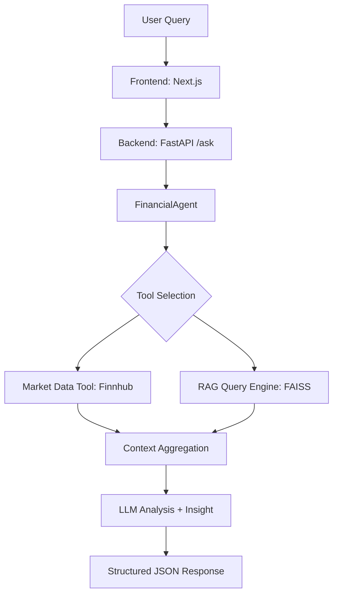

# MarketMind AI - Project Context

MarketMind AI is a modular financial AI assistant that provides insights into market data and financial concepts using tool-based reasoning and Retrieval-Augmented Generation (RAG).

## Project Overview

- **Purpose**: Answer financial questions using live market data (Finnhub) and local knowledge (LlamaIndex + FAISS).
- **Backend**: Python 3.12+ with FastAPI, LlamaIndex for agentic workflows, and FAISS for vector storage.
- **Frontend**: Next.js 14 (App Router), TypeScript, Tailwind CSS v4, and shadcn/ui.
- **Key Features**:
    - AI-driven sentiment analysis and market insights.
    - Live stock data fetching.
    - RAG-powered financial document retrieval.
    - MCP (Model Context Protocol) integration for tool exposure.

## Architecture



## Core Components

- **FinancialAgent**: Orchestrates query analysis, tool selection, and context aggregation.
- **Market Data Tool**: Fetches live stock prices and metrics from Finnhub.
- **RAG Query Engine**: Retrieves relevant snippets from financial documents stored in `data/financial_docs/`.
- **MCP Server**: Exposes internal tools to external LLM clients via the Model Context Protocol.

## Building and Running

### Backend

1.  **Create and activate a virtual environment**:
    ```bash
    python -m venv venv
    .\venv\Scripts\Activate.ps1  # Windows
    source venv/bin/activate      # Unix/macOS
    ```
2.  **Install dependencies**:
    ```bash
    pip install -r requirements.txt
    ```
3.  **Build the RAG Index**:
    ```bash
    python -c "from app.rag.index_builder import build_financial_index; build_financial_index()"
    ```
4.  **Run the API**:
    ```bash
    uvicorn app.main:app --reload
    ```

### Frontend

1.  **Navigate to the frontend directory**:
    ```bash
    cd frontend
    ```
2.  **Install dependencies**:
    ```bash
    npm install
    ```
3.  **Run the development server**:
    ```bash
    npm run dev
    ```

## Testing

Run the Python test suite using `pytest`:

```bash
pytest tests/ -v
```

Tests cover API routes, agent logic, RAG pipeline, and market data tools.

## Development Conventions

- **Backend**:
    - Follow PEP 8 style guidelines.
    - Use Pydantic for request/response validation and settings.
    - Asynchronous endpoints where appropriate.
    - Comprehensive logging via standard `logging` module.
    - **Error Handling**: Tool-level failure isolation in agent orchestration; centralized FastAPI catch-all handler.
- **Frontend**:
    - **CRITICAL**: The project uses Next.js 14.2.35. Heed deprecation notices and refer to `node_modules/next/dist/docs/` if needed, as conventions may differ from older versions.
    - Next.js App Router for routing.
    - Tailwind CSS v4 for styling.
    - shadcn/ui for consistent UI components.
    - Lucide icons for iconography.
    - Hydration-safe components (especially for theme toggling).

## Environment Variables

Create a `.env` file in the root directory:

```dotenv
FINNHUB_API_KEY=your_finnhub_api_key
OPENAI_API_KEY=your_openai_api_key (optional, for LLM reasoning)
```

## API Snapshot

- `GET /health`: Returns service status (`{"status": "running"}`).
- `POST /ask`: Primary endpoint for financial queries.
    - **Request**: `{"query": "string"}`
    - **Response**: `{"analysis": "string", "data": {...}, "insight": "string"}`
