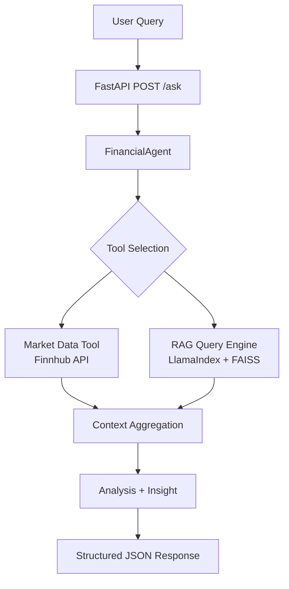

# Financial AI Assistant

Financial AI Assistant is a modular backend service that answers financial questions using tool-based reasoning.

It combines:

- FastAPI for HTTP serving
- Finnhub API for live market data
- LlamaIndex + FAISS for retrieval-augmented knowledge
- MCP Python SDK for tool exposure and execution
- A reasoning agent that routes and aggregates tool output

## Architecture Diagram



## Example Queries

- What is P/E ratio?
- How did AAPL perform this week?
- Explain market capitalization.
- Compare valuation metrics used in equity analysis.

## Quick Setup

### 1) Clone and Enter Project

```bash
git clone https://github.com/MercuryConnor/marketmind-ai
cd marketmind-ai/financial-ai-assistant
```

### 2) Create Virtual Environment

```powershell
python -m venv venv
.\venv\Scripts\Activate.ps1
```

### 3) Install Dependencies

```bash
pip install -r requirements.txt
```

### 4) Configure Environment Variables

Copy [financial-ai-assistant/.env.example](financial-ai-assistant/.env.example) to `.env` in the project root and set your Finnhub key:

```dotenv
FINNHUB_API_KEY=your_real_finnhub_key
```

### 5) Build Local RAG Index

```bash
python -c "from app.rag.index_builder import build_financial_index; build_financial_index()"
```

### 6) Run API

```bash
uvicorn app.main:app --reload
```

### 7) Verify

```bash
curl http://127.0.0.1:8000/health
curl -X POST http://127.0.0.1:8000/ask -H "Content-Type: application/json" -d '{"query":"What is P/E ratio?"}'
```

## API Snapshot

- GET /health
    - Returns service status.
- POST /ask
    - Request: {"query": "..."}
    - Response: {"analysis": "...", "data": {...}, "insight": "..."}

Detailed API docs: [docs/api.md](docs/api.md)

## Project Structure

```text
financial-ai-assistant/
    app/
        api/
        agents/
        rag/
        tools/
        mcp/
        services/
        main.py
    data/
    tests/
    docs/
    requirements.txt
    README.md
```

## Documentation

- Architecture: [docs/architecture.md](docs/architecture.md)
- Setup: [docs/setup.md](docs/setup.md)
- API: [docs/api.md](docs/api.md)

## Testing

```bash
python -m unittest discover -s tests -p "test_*.py" -v
```

## License

MIT
